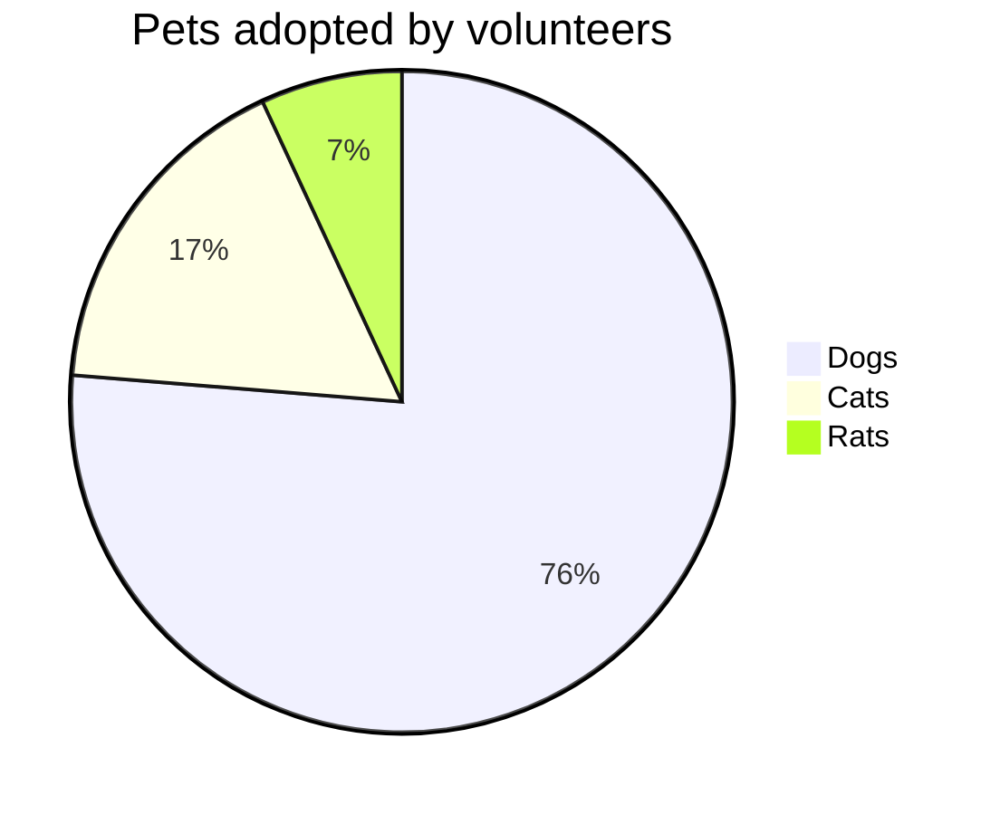

# Key Differences Between CI/CD and DevOps

**CI/CD 被定义为一组能够快速、可靠地交付代码更改的开发实践。DevOps 被定义为思想、实践、流程和技术的集合，允许开发和运营团队共同工作以简化产品开发。虽然这两个概念相关，但它们在很多方面都有所不同。**


最近看到一个图，非常清晰的描述了 CICD/DevOps之间的关系。 


---

# 分类比较

| 分类        | CICD | DevOps |
| :--------  | :-----  | :-----  |
| 定义 | 持续集成和持续交付（通常缩写为 CI/CD）是一组原则和实践，旨在帮助开发团队确保频繁代码更改的可靠交付。CI/CD 需要对应用程序生命周期进行持续自动化和监控，从集成和测试到产品的交付和部署。CI/CD 实践的实施，也称为“建立 CI/CD 管道”，是 DevOps 团队需要遵循的工作流程最佳实践。组织依靠 CI/CD 管道来最大限度地减少软件开发和交付过程中的瓶颈。持续集成优化了开发环境中的构建、集成和测试代码，而持续交付则涉及有效的生产部署。 | DevOps 是由“开发”和“运营”组合而成的术语。 这种协作文化概述了有助于简化产品开发的一系列想法、实践、流程和技术。DevOps强调开发和运营团队之间的有效集成、沟通和协作，促使他们专注于高质量产品的交付。DevOps 方法可帮助组织建立生产团队和流程，以鼓励快速、持续部署的方式创建软件。DevOps 的核心是主张最大限度地减少浪费并创建易于扩展且持久的系统。 |
| 范围 | 持续集成（CI）是软件工程的一项原则，鼓励团队频繁地集成他们的工作。 遵循这种做法的人员的目标是至少每天（如果不是每小时）进行整合。 传统上，集成是一项成本高昂的活动，需要在不同的工程团队之间进行大量的来回讨论。 为了应对这一挑战，持续集成推动了测试和构建自动化工具的采用。 这种自动化的最终目标是创建软件定义的生命周期。 成功的 CI 意味着最大限度地减少集成工作，使团队能够快速发现并修复集成错误。 就像 CI 优化构建和测试流程一样，持续交付 (CD) 提高了打包和部署活动的效率。 采用 CD 的团队可以以支持软件定义生产的方式设计、构建、打包和部署软件，从而最大限度地降低成本并最大限度地提高自动化程度。 如果正确实施，CI/CD 可以将软件更改频繁交付到生产中。 这为用户提供了更多分享反馈的机会，从而拥抱敏捷开发文化。 | DevOps 原则的重点是能够快速有效地响应生产问题，否则由于开发和运营团队中普遍存在的过度专业化和过度专业化的文化，这些问题将变得困难。 DevOps 的目标是通过交叉培训和流畅的沟通渠道打破工程和运营团队之间的障碍。 这些原则提高了协作和沟通水平，并使这些团队了解彼此的流程和职能。 |
| 目标 | CI/CD 将应用程序代码的所有更新编译到单个存储库中，然后对其执行自动化测试。 此过程可确保产品的完整开发并为部署做好充分准备。 CI/CD 的主要目的是实现快速、高效、自动的产品更新推出。 此过程还可以减少产品缺陷，从而提高平均用户满意度。 从本质上讲，强大的 CI/CD 管道可以提高“速度质量”，为运营和产品开发团队增加价值，并提高企业的业务价值。 | DevOps 解决了许多组织面临的一个关键问题——软件生产过程中运营和开发团队之间的巨大脱节。 这些同等重要的团队之间的沟通差距和缺乏合作很可能因协作不足而导致发展挑战。 DevOps 的目的是合并开发和运营功能，并将整个生产周期中发生的流程整合在一起。 DevOps 推动更加敏捷、简化和高效的软件生产流程。 其目标是在团队之间发展和维护共同的、共享的文化，从而实施共享的业务流程并提高协作水平。 简而言之，强大的 DevOps 文化可以帮助团队实现共同的业务目标，而不是孤立的部门目标。 |
| 过程 | 采用持续集成方法的开发人员尽可能频繁地将其更改与主应用程序合并。 这些更改通过创建经过自动化测试的构建来验证。 此过程可帮助团队避免等待发布日集成更改时可能出现的挑战。 持续集成还强调测试自动化，以便在集成新代码时检测错误和性能问题。 持续交付过程是持续集成的延伸。 它需要在测试和生产阶段自动部署所有代码更新。 通过持续交付，团队可以享受自动化测试和发布流程，并且只需点击按钮即可部署最新的应用程序版本。 | 采用 DevOps 方法需要实施以下流程：      开发各个方面的自动化，例如工作流程、新代码测试以及基础设施配置以减少过度工作和浪费。     迭代开发，即在固定时间内编写小段代码，旨在推动发布和子发布，提高部署的频率和速度。     通过不断测试、根据反馈采取行动以及从失败中学习来优化成本、性能和部署时间来持续改进。     团结团队，打破孤岛，促进 IT 运营、开发和质量保证之间的沟通。 持续测试、监控和反馈实施，以及更小但更快速的部署，是 DevOps 流程的定义特征，并允许企业成功地拉近开发人员、IT 团队和最终用户之间的距离。
| 实现 |  Jenkins 是一款开源自动化服务器，是当今最流行的 CI/CD 解决方案之一。 采用 Jenkins 是为任何具有相关用例的企业实施 CI/CD 管道的简单方法。 Jenkins 必须正确配置所需的依赖项才能实现。 以下步骤可以帮助您的 IT 人员在 Windows 环境中实施 Jenkins，从而为您的团队创建 CI/CD 管道：      第 1 步：登录 Jenkins 并选择“新建项目”。     步骤 2：从菜单中选择“Pipeline”，为管道命名，然后单击“OK”。     步骤 3：通过设置构建触发器和其他选项来配置管道。 “管道定义”部分允许您定义管道阶段。 设置管道时，您可以使用声明性语法和脚本语法。 完成后，单击“应用”和“保存”。     第 4 步：选择“立即构建”来执行管道。 管道阶段执行完成后，可以在“阶段视图”部分查看结果。 检查构建的控制台输出以验证管道是否成功执行。     步骤 5：您可以通过添加更多阶段来扩展管道定义。 为此，请选择“配置”并修改管道定义。 要执行新管道，请保存更改并选择“立即构建”。 成功执行后，可以在“阶段”视图中检查每个新阶段。 检查控制台日志以验证代码的执行是否按预期进行。     第6步：使用“PipelineTimeline”插件优化管道阶段的可视化。 安装插件后，可以在构建阶段中找到“构建时间线”选项。 选择此选项将向您显示管道事件的时间表。 在 Jenkins 中成功实施 CI/CD 管道后，可以通过集成测试框架、外部代码存储库和部署策略来扩展它。 | DevOps 的采用是一种流程转变，也是一种文化转变。 旨在分阶段实施 DevOps 原则，以确保最小的干扰和最大的收益。 这可以通过执行以下步骤来实现。     步骤 1：首先建立敏捷开发流程。     步骤2：所有相关流程采用云计算，并实施CI/CD工作流程。     步骤 3：自动化软件部署和测试流程。     步骤4：采用持续部署。 DevOps 自动化需要基础设施和工具的转变，否则，DevOps 流程中可能会出现差距。 真正的 DevOps 环境在开发流程的每个阶段都是自动化且敏捷的。 绘制 DevOps 流程的可视化方法使 IT 团队能够了解流程、时间表以及分配给每个资源的任务。 视觉效果确保每个人从一开始就处于同一页面上，从而使实施过程变得无缝。 |
| 阶段 | | |
| 优势 | | |
| 使用场景 | | |


flowchart LR
A[Hard] -->|Text| B(Round)
B --> C{Decision}
C -->|One| D[Result 1]
C -->|Two| E[Result 2]


```plantuml
Bob -> Alice : hello world
```





@startuml
Bob -> Alice : hello
@enduml


@startmermaid
pie title Pets adopted by volunteers
  "Dogs" : 386
  "Cats" : 85
  "Rats" : 35
@endmermaid
